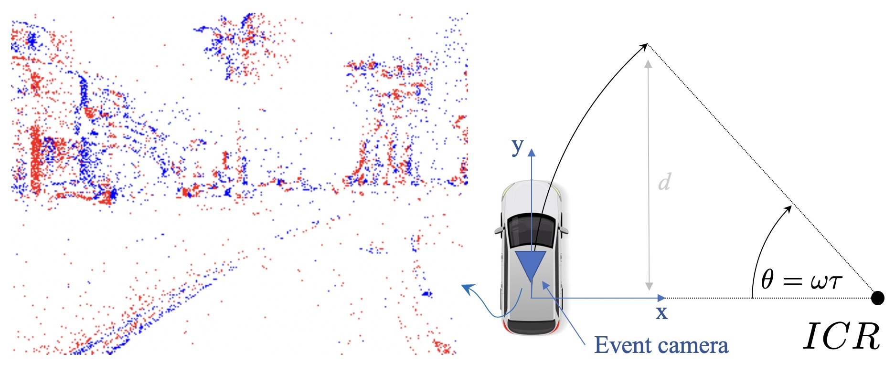

<h1 align="center">NHEVO: Event-based Visual Odometry on Non-holonomic Ground Vehicles</h1>
<p align="center">
    <a href="https://gowanting.github.io/">Wanting Xu</a><sup>*</sup> &emsp;&emsp;
    <a href="https://mpl.sist.shanghaitech.edu.cn/People.html">Si’ao Zhang</a><sup>*</sup> &emsp;&emsp;
    <a href="https://mpl.sist.shanghaitech.edu.cn/People.html">Li Cui</a><sup>*</sup> &emsp;&emsp;
    <a href="https://scholar.google.com/citations?user=OOCGZqkAAAAJ&hl=zh-CN">Xin Peng</a><sup></sup> &emsp;&emsp;
    <a href="https://mpl.sist.shanghaitech.edu.cn/Director.html">Laurent Kneip</a><sup></sup>
</p>

<p align="center">
    <sup>*</sup>equal contribution
</p>

<p align="center">
    <sup></sup>Mobile Perception Lab,
    <sup></sup>ShanghaiTech
</p>

<p align="center">
    International Conference on 3D Vision (3DV) 2024, Davos, CH
</p>
<p align="center">
    <a href="https://ieeexplore.ieee.org/abstract/document/10550819"><strong>Paper</strong></a> |
    <a href="https://arxiv.org/pdf/2401.09331.pdf"><strong>arXiv</strong></a> |
    <a href="https://youtu.be/gw5iJBQkk0M"><strong>Video</strong></a> |
    <a href="assets/poster.pdf"><strong>Poster</strong></a> |
    <a href="#citation"><strong>BibTeX</strong></a>
</p>


The open-source implementation of "Event-based Visual Odometry on Non-holonomic Ground Vehicles".

<p align="center">
  
</p>

We consider visual odometry with a forward-facing event camera mounted on an Ackermann steering vehicle for which motion can be locally approximated by an arc of a circle about an Instantaneous Centre of Rotation (ICR). We assume constant rotational velocity during the time interval for which events are considered.

## Abstract

Despite the promise of superior performance under challenging conditions, event-based motion estimation remains a hard problem owing to the difficulty of extracting and tracking stable features from event streams. In order to robustify the estimation, it is generally believed that fusion with other sensors is a requirement. In this work, we demonstrate reliable, purely event-based visual odometry on planar ground vehicles by employing the constrained non-holonomic motion model of Ackermann steering platforms. We extend single feature n-linearities for regular frame-based cameras to the case of quasi time-continuous event-tracks, and achieve a polynomial form via variable degree Taylor expansions. Robust averaging over multiple event tracks is simply achieved via histogram voting. As demonstrated on both simulated and real data, our algorithm achieves accurate and robust estimates of the vehicle’s instantaneous rotational velocity, and thus results that are comparable to the delta rotations obtained by frame-based sensors under normal conditions. We furthermore significantly outperform the more traditional alternatives in challenging illumination scenarios.

## Usage

### Dependencies

- dlib
- Eigen3

### Build

```bash
git clone git@github.com:gowanting/NHEVO.git ./nhevo
cd ./nhevo

cmake -B build && cmake --build build

# optional
cmake --install build
```

### Example

We provide a minimal ros example under `example`, you can easily modify `example/src/main.cpp` to remove ros dependency. Parameters are defined in `config/config.yaml`.

You need to attach your own implementations of a feature detector (Point or Verticle Line) and a tracker, see details in `tracker.hh` and `detector.hh`.

```bash
cd ./example

cmake -B build && cmake --build build

roscore &
rosbag play your_dataset.bag &

./build/nhevo
```

## Citation

If you find this work useful, please consider citing:

```
@INPROCEEDINGS{xu24,
  title = {Event-based Visual Odometry on Non-holonomic Ground Vehicles},
  author = {Xu,~W. and Zhang,~S. and Cui,~L. and Peng,~X. and Kneip,~L.},
  year = {2024},
  booktitle = {In Proceedings of the International Conference on 3D Vision}
}
```

## Acknowledgments
This work is inspired by the following work:

*Huang, Kun, Yifu Wang, and Laurent Kneip. "Motion estimation of non-holonomic ground vehicles from a single feature correspondence measured over n views." Proceedings of the IEEE/CVF Conference on Computer Vision and Pattern Recognition. 2019.* ([link](https://openaccess.thecvf.com/content_CVPR_2019/papers/Huang_Motion_Estimation_of_Non-Holonomic_Ground_Vehicles_From_a_Single_Feature_CVPR_2019_paper.pdf)).


The authors would also like to thank the fund support from the National Natural Science Foundation of China (62250610225) and Natural Science Foundation of Shanghai (22dz1201900, 22ZR1441300). We also want to acknowledge the generous support of and continued fruitful exchange with our project collaborators at Midea Robozone.
